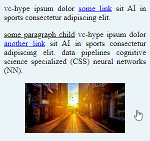
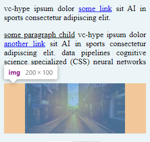

# Preventing Background Click of Link-Wrapped Image with `:has()`

Oftentimes websites provide an option to enlarge images in a popup overlay which is implemented with a JavaScript-based solution like lightbox. If you want to provide a [graceful fallback](https://www.roadmappy.com/maps/client/browser_compatibility) for users that don't run JavaScript (e.g. bad internet connection), you can do this:

**Wrap an an anchor tag around the image linking to the image URL!** Then a click will open the image in full screen. That is basically the same as right clicking the image and manually opening it in a new window. Here is an example:

```html
<a href="tobiobeck.com/favicon.png">
    
</a>
```

But my initial implementation had one problem. When the image is too small to fill the full width of the parent container, clicking on the background to the left or right of the image would also open the image. Makeing the empty space clickable feels weird and on mobile devices it is very easy to accidentally trigger a click on the background while reading and scrolling through the text.


_Do you see how the mouse cursor has a pointer shape indicating something is clickable?_

Analyzing the problem source, we can see that the image tag (`` has a margin. The anchor tag (`<a>`) is wrapping around the image tag. So, it also **wraps around the margin and the space it occupies**. The margin becomes clickable, which we don't want.



We can prevent this without adding additional HTML elements by removing the margin from the image tag (``) and instead applying it to the wrapping anchor `<a>` tag. Naively applying a horizontal margin to all anchors would be bad because it would butcher normal links in prose text. Therefore, the handy [pseudo-class `:has()`](https://developer.mozilla.org/en-US/docs/Web/CSS/:has) can be used.

 `margin: auto;` Because applying a margin

Before I show that, let's first establish some common ground with the following example code. We have 4 text paragraphs that contain some links. The latter two paragraphs contain an image.

The solution is to make the image `display: block`.

```css
.container a:has(img) {
    display: block;
    margin: auto;
    max-width: fit-content;
}
```

```html
<div class="container">
    <p>
        vc-hype ipsum dolor <a target="_blank" href="http://google.com">some link</a> sit AI in sports consectetur adipiscing elit.
    </p>
    <p>
        <u>some paragraph child</u> vc-hype ipsum dolor <a target="_blank" href="http://google.com">another link</a> sit AI in sports consectetur adipiscing elit. data pipelines cognitive science specialized (CSS) neural networks (NN).
    </p>
    <p>
        <a target="_blank" href="https://picsum.photos/200/100">
            
        </a>
    </p>
    <p>
        <a target="_blank" href="https://tobiobeck.com/favicon.png">
            
        </a>
    </p>
</div>
```

```css
body, p {
    margin: 0;
}

.container {
    width: 300px;
    background-color: #ebf4f7;
}

.container p {            
    padding: 0.5rem;
    text-align: justify;
}

.container img {
    display: block;
    margin: 0 auto;
    background-color: #eee;
}
```
