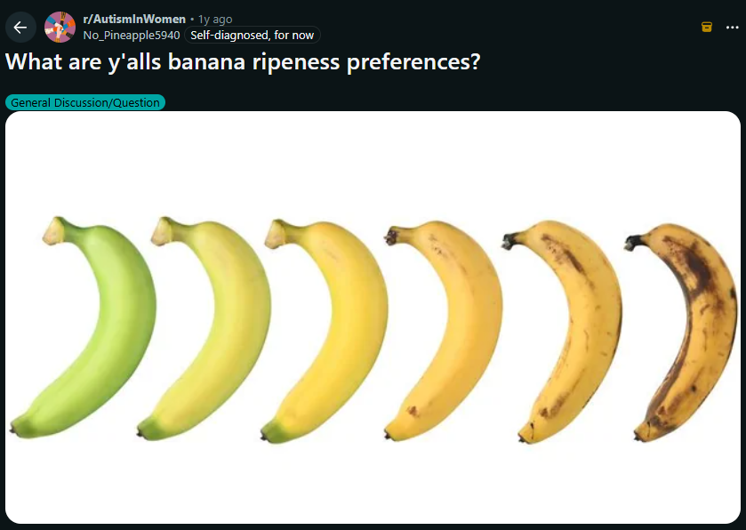
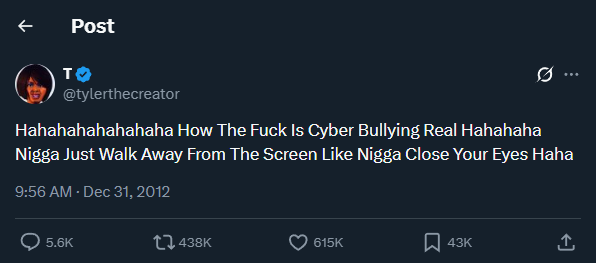
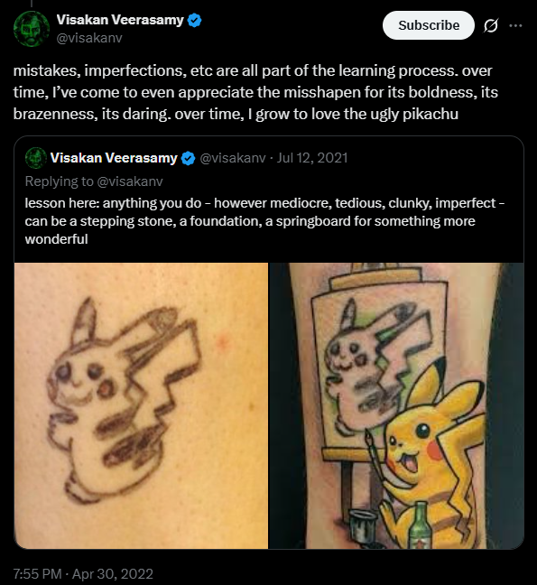
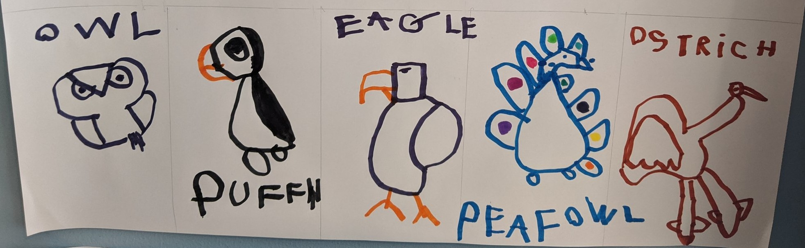
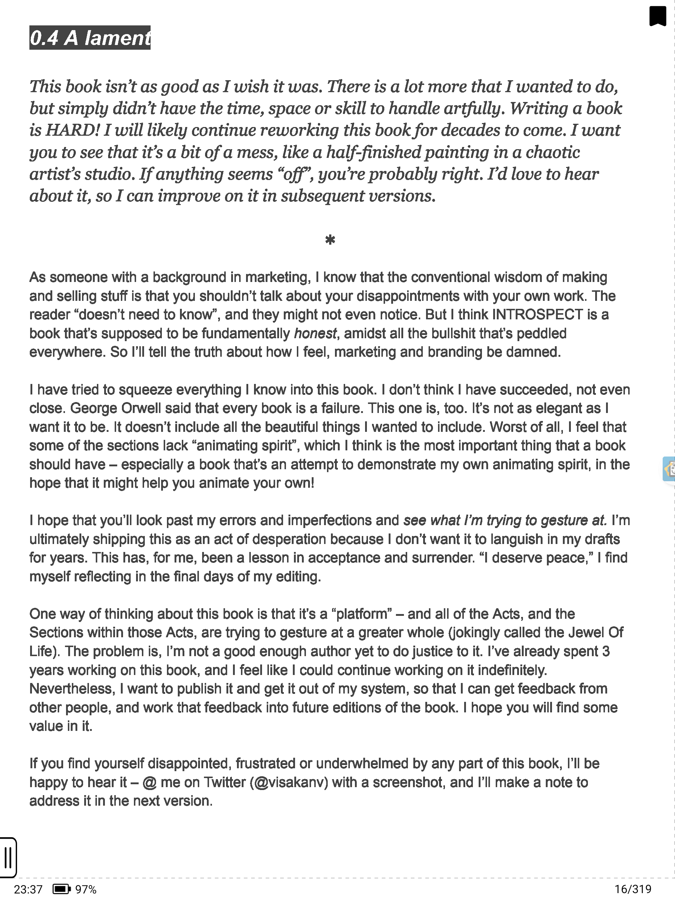

# Share Half-Baked Cakes

Jean-George Vongerichten baked cakes for 500 party guests but made a critical mistake, which could've ruined the party and also his reputation. Here is the story about underbaked cakes and what we can learn from it about one's own taste, negative self-talk, fear of judgement and sharing in public.

When Vongerichten baked the cakes, he made one consequential error. His recipe was not meant for such a large crowd. He didn't adjust the oven's heat setting nor baking time to account for the especially large number of cold batter. As a result, he took out underbaked cakes that were properly done from the outside but still soft and runny inside. The waiter noticed the half-baked cakes. But it was already too late. 500 cakes have been served to the guests.

Vongerichten expected the worst and saw his career on the line. But to his surprise the people loved it and gave a standing ovation. A new dish was born and is nowadays known as Lava Cake. If Vongerichten would've noticed the mistake earlier, he would've likely thrown the cakes in the trash and never made this discovery. He would've dismissed what others loved.

In a similar vain it is easy to dismiss your own creations. How can you even judge your own work objectively when you are the most biased person anyway? Nor do you know the taste of the recipient. Some people prefer the crispy part, some the soft part, and some love the combination. The best part is very subjective. A good example of this are the comments on social media posts like: "What degree of banana ripeness is the right amount?" There is a range of different preferences from various people.

Imagine some varied comments from different people: Someone liking the yellow to greenish one because they are high in fibre and low in sugar. Another person like the riper sweeter ones but hates the disgusting black dots and mushy mushy texture. Yet another person has a hard time throwing away an overripe banana and makes pancakes with them etc.

The same applies for consuming media. Different people get the most out of different parts of a YouTube video, a blog post or a book. Some people like the easy to understand introduction, some the joke in the middle, while others got their appetite for knowledge satiated during the dense in-depth part at the very end.

This also applies in the world of startups where founders are convinced their startup is the greatest next big thing that ever existed. But the market decides often differently. Only 5% or whatever small number of businesses survive longer than 5 years (_I don't care to look up a source but something in this direction should be right_). Basically the same can be said about a single founder with many products. For the indie hacker Pieter Levels (@levelsio) [only 5% of his products reached product-market fit](https://x.com/levelsio/status/1457315274466594817). All else were duds and not worth investing more time into.

> Only 4 out of 70+ projects I ever did made money and grew
> 95% of everything I ever did failed
> My hit rate is only about ~5%
> So...ship more - levelsio

Same for investing into startups by incubators/accelerators or VCs. Only a small fraction of their portfolio will have outstanding returns. Most startups fail in the early days/years without finding product market fit. But a few exceptional ones create outstanding returns, which makes it up for the failed ones and worth it altogether. And the investors know this. That's why they diversify their investment into multiple startups instead of throwing everything into one bucket.

So, publish more small, experimental, or half-finished things and let the public decide what is worth and what isn't. Quantity creates more opportunities for outlier success. And I also believe that quantity eventually leads to quality. So, every half-baked creation counts as repetitions for practice; at least if you try your best and invest deliberate effort. There is a parable called the Pottery Paradox that supports this idea (more about it in the footnotes[^1]). Visakan Veerasamy shares the sentiment about high quality work by sheer chance: 

> This is the luck you get from _doing things_. If you write lots of tweets, eventually some of them will do better than others. Maybe you accidentally said something insightful-sounding.  
> 
> People who don’t tinker persistently may not appreciate just how _the process of tinkering itself fundamentally introduces variability._ Someone with “B” level ability on average will occasionally produce A+ work by sheer chance. If you’re lucky, it will be recognized and you will be rewarded accordingly. (Notice the passive voice here – it’s significant, because…)
> https://www.visakanv.com/blog/luck/

---

But how come we have so much fear and restriction to speak our minds and share our creations on the internet? How come so many people fear public speaking in front of an audience? How come many men feel social anxiety approaching an attractive woman?

It's fear.

It's the fear of being rejected, ignored or even ridiculed. The fear of judgment and negative consequences. The fear of not being good enough. We evolved to be social animals after all. So, from an evolutionary perspective the acceptance of and status in the tribe was of utmost importance for our well-being.

I know there are near endless opportunities out there on the Internet. From YouTubers, entrepreneurs, and book authors that make a fortune to job opportunities, [friend catchers](https://roadmappy.com/maps/motivation/benefits_personal_website#further-reading), and other serendipitous happenstances. And nonetheless I have a hard time publishing my creations. Even while sending something as trivial as a single Tweet, I occasionally feel friction and resistance. 

When I tweet something and there is no reaction, I feel dumb and the same embarrassment that Vongerichten probably felt when serving underbaked cakes. _"This was a bad take or simply uninteresting; I'm wasting my time"_. But nothing ever happens. Literally nothing. So, far there have been no consequences beside my hurt pride and ego. But the upside could still be huge.

Maybe nobody will read this article. Maybe it's just not that interesting. So, why should I put in the effort to write this? I do believe, I have something valuable to share. At least, it feels worthwhile to me. So, I am mostly writing this for myself to find ways to overcome this inner resistance to publish. Even if nobody else cares. I do. Every written word is an opportunity to think through an issue. Writing is thinking after all. And even simply collecting and curating a bunch of tweets or pieces of media can be seen as an act of curation and getting in tune with my own interests; learning to know myself better. If I am passionate enough about a topic or activity to spend time with it or even make posts on the Internet, I obviously do care about it. So, even if you think _no one cares_, there is always an audience of at least one. Yourself.

Often perfectionism is preventing us from finishing and reaping the fruits of our labor. We spend a lot of time polishing the last bits, while neglecting the diminishing returns of investment; aka the pareto principle. As a person with a high quality bar, it's a good to remind myself that most other people are already satisfied with the reached quality. You might see all it's flaws and shortcomings to improve but there is no further value letting it sit in the drafts folder indefinitely. Perfect is the enemy of good enough. So, it could just as well be an avoidance strategy fueled by the above mentioned fears. The inner critic is asking too many questions:

- Does this essay contain any original ideas?
	- Probably not.
- Did I create something unique by remixing existing ideas?
	- Maybe.
- Is it memorable?
	- I hope so.
- Is it valuable?
	- At least for me.

Having your own thoughts and inner world under control is one thing. However, the thoughts and actions of other people are out of your control. Maybe someone will criticize your work, or you directly by writing mean comments, insults or the like. But why would you care about the opinion of such a person? Why worry about what other people might think? Why fear their judgment? By sharing your creations, you show who you are, what you care about, and make yourself vulnerable to some degree. Hiding your personality wouldn't help either. Why would you put on a mask for a person that doesn't care to understand you or who you are -- your authentic self? That doesn't make sense. So, focus on the people who care. And remember that you can always simply turn off the screen if things get to overwhelming.

There are too many projects that end up rotting away in a dusty corner never brought into the light of day; never seen by anyone else. Or even worse, some projects stay an idea in someone's head. Paralyzing procrastination and unrevealed fears prevent it's genesis in the first place. Derek Sivers describes the tragedy of this unrealized potential quite graphically in the short essay ['Here’s how to live: Create.'](https://sive.rs/htl23) (snippet in the screenshot below). People take their untapped potential to the grave.

If you don't finish nor share, you'll likely feel regret and (subconsciously) think of yourself as a quitter. I also feel this kind of regret for a couple of things (a bit of a rambling anecdote ahead): for example, I worked on a cool rhythm game for a web browser and a device that visualize the played drum/note from my real e-drum set; more precisely, a Guitar Hero clone web application and Arduino-powered LED visualization (both with MIDI support). Maybe I am the only person world-wide that built this exact combination of things. And still, I never made a proper video showing it off.

I only made mediocre videos with a smartphone of me hitting the drums, while playing the game. You hear the clickety clackety of the drum heads but not the audio that I hear via headphones. I showed these videos to some friends. But never made a proper recording attempt to also capture the game's sound and song audio because it would required extra steps to record the different media sources and edit it into a video as a whole. The additional effort was a too high of an barrier for me to take action. I worked on it for 9 month but by now (another year passed) the momentum and motivation is kinda lost. I still want to create the video to validate if this web game would be interesting to other people; I could publish it as a product but don't want to invest more time into it without feedback.

_
At least, I shared it to some friends and so far the resonance was positive. (Well that's what good friends are for even if the game is subpar). While writing this, I am wondering why I didn't share the mediocre video on Reddit or the like? Well, I guess that's why I am writing this essay to unblock me and unlearn this behavior.
_

_
Well, now I finally did make the video. I've been postponing to publish this essay due to the missing video for a veryyy long time. I guess I've learnt nothing from this essay, lol. But also I didn't expect that it would be such a struggle to record the e-drum sounds and also the background song from the game at the same time (plus recording a video of me playing with a camera and then editing everything together in post production).
_

_
I couldn't figure out how to wire the (virtual) MIDI cables from the web application into two things at the same time: 1. the Arduino LED visualization and 2. an audio program (Reaper DAW) for recording good drum sounds. All sorts of fuckups: driver issues, weird static noise, lags... Eventually, I realized I could simply record the drum sounds from my e-drum module directly. This sounds a bit worse than the sounds from the audio program but this finally unblocked me. When a friend asked me yesterday about the project, I got the motivation to pick it up again do a recording session. After 14 takes, I got one that was good enough™.
_

_
So, I guess I learned at least something from my essay.
_

Here the video: https://youtu.be/msxFJdPYoAk

<iframe width="560" height="315" src="https://www.youtube.com/embed/msxFJdPYoAk?si=SjLEqyHZZMmher4E" title="YouTube video player" frameborder="0" allow="accelerometer; autoplay; clipboard-write; encrypted-media; gyroscope; picture-in-picture; web-share" referrerpolicy="strict-origin-when-cross-origin" allowfullscreen>asd</iframe>

---

The point I am actually trying to make is that even unfinished or half-baked creations deserve to be shared. An essay with great ideas, a few stuttering sentences and many typos is still a great essay in my view. There is no special price for perfect grammar and spelling. Even your scrappy thing can be valuable for someone else. Sharing is caring.

An example and proponent of this idea is Visakan Veerasamy with his self-published ebook Introspect. The book is unpolished in many ways compared to traditional book publishing standards (e.g. a bit repetitive, verbose, not proof-read by an editor, and so on). Among other topics, it covers themes like understanding your emotions, clearing mental fog, and resolving inner conflicts that prevent you from living your life to the fullest. It contains all sorts of advice to try and could be described as a handbook for digging deeper into one's self to uncover the root cause of personal problems and shortcomings in your life.

A particularly interesting section contains meta-commentary in right-aligned text that is written in a kind of fourth-wall breaking way (see a screenshot of the text snippet in the footnotes[^2]). It's a clear cut from the normal prose, which allows the reader to witness the author's inner monologue and self-critical thoughts. The kind of self-doubting thoughts and mental negotiations, you might have with yourself as well.

The commentary compares and puts the imperfection of both the book and one's life into perspective. It describes the flaws of the book and how it should be further improved in future versions. The writing project was challenging and at the edge of the author's abilities. He describes that he has to publish the book in it's current state, otherwise it would stay in the writing stage for too long and not serve anyone.

The stylistic choice of presenting his self-critical thoughts about the book as a meta-commentary in right-aligned text drives home the message that even things in an imperfect state serve value to others. It's about a kind of acceptance that nothing will ever be perfect, whether it is issues in someone's life or the flaws of a book. In a sense this section feels like an art form in itself that elevates the book as a whole. It's authentic and admits the author's and book's flaws honestly. It communicates something that couldn't be communicated better any other way because the meta-commentary feels real. It's a real example of the author's struggles and it's also real for the reader because the resulting book with it's eventual flaws can be observed while reading it. The medium is the message.

And it's an effective message delivered in a way that wouldn't even be possible if the book was polished and proof-read by traditional book publishing standards. A highly polished book wouldn't contain repetitive and rambling sections and thus wouldn't demonstrate the author's struggles. An editor would've likely removed the meta commentary and with it a view into the author's mind and doubting thoughts. Thoughts that everyone has but are rarely talked about.

Nor would've anyone got this message if the author would've spent more and more years perfecting the book. If the quality bar was kept too high, the most likely outcome would've been frustratingly quitting the book project or postponing publishing it indefinitely.

I would've never got this message. Nor would this essay exist, I believe.

But the book contains lots of valuable insights, many things to try, loads of interesting quotes. It reminds us to have fun, be playful, and take life with humor even in dire situations. You can break out of the societal norms, you can play around with words, formatting and just do things™. Any way you want. Sometimes there is even more value in scrappy unpolished things. There is a certain kind of beauty in imperfection, e.g. [the subreddit wellworn](https://www.reddit.com/r/Wellworn/top/?t=all), or this drunk Pikachu cover up tattoo:

**Share your half-baked cakes.**

**People are hungry.**

​

​

​

​

​

---

P.S.
Having written this essay -- and it has been sitting to simmer at the back of my head -- I come back to it now because I got another insight. I think, deep down it's the fear of being perceived as incompetent or not capable. It's this need of being perceived as flawless as possible and great overall. Publishing something unpolished, would make me look bad. People might think, I can't do it better. Maybe I could but I currently don't have the time, headspace, energy or whatever to do a better job. Basically my ego and pride would be hurt and that's preventing me from sharing earlier. Acknowledging this is a good start. I guess becoming independent of external validation is another step and part of the journey.
_(I got this thought from the "You can just do things" [questionare](https://www.catehall.com/cringe-minefield-quiz) by Cate Hall and the section about  incomplete Spiderman drawing in ["Matryoshka of Possibilities"](https://visakanv.substack.com/p/a-matryoshka-of-possibilities) by Visa)_

In the end, the things that are unpolished are more raw and honest in contrast to work that is so flawless it feels sterile. Unpolished work has other qualities, e.g. more personality or evoking another set of emotions. Just like the ugly Pikachu and goofy Spiderman (or the work of kids that were not socialized yet[^3]. Their learning didn't converge on social convention yet so they are still drawing in a kind of non-conformists way. See for example, these [bird drawings](https://x.com/dansinker/status/1272564438315532292) of a four year old:

> When children learn to draw, they tend to make more and more interesting images for several years until around age five, when they learn to be boring. - [Henrik Karlsson](https://www.henrikkarlsson.xyz/p/being-creative-requires-taking-risks)

---

Here are some other aspects and benefits of sharing that I felt like didn't contribute enough to the essay or didn't fit into the reading flow. And some related thoughts. Maybe these are still helpful to someone:
- You can get free feedback. If you say something wrong, you'll be corrected aka Cunningham's law.
- Even failures and set backs can be framed as valuable learnings lessons and thus are worth sharing.
- What's obvious to you, isn't for others. There are 10.000 people everyday discovering something for the first time ([obligatory xkdc](https://xkcd.com/1053)). Maybe the thing you aren't sharing yet, could be such a discovery for someone else.
- You can even consume your own creations in the future and have a one-way conversations with your past-self. Its like cutting a slice of your personality of that time and preserving it in resin. Wouldn't that be an interesting conversation partner?
- Often a catchy phrase is what sells an idea. "Share half-baked cakes" is my attempt at such a phrase. I was also considering "Half baked is edible" beforehand. There are probably some lessons about marketing or memetics to learn about why some ideas spread when packaged with a good mnemonic.
- writing down your thoughts can help you become more clear and aware about some things. You can practice this with every written piece of text, even an email. It will likely make you a better communicator and storyteller. After all ["the most powerful person in the world is a storyteller."](https://www.google.com/search?q=steve+jobs+%22The+most+powerful+person+in+the+world+is+a+storyteller%22)
- Further reading
	- https://x.com/visakanv/status/1544989038087614464?s=20
	- "Lurk less poast more" explores the side of using social media as a form of self-expression.

---

Another concern that I didn't address, are statements that might clash against the values of your supervisor or employer in general. I don't have a good answer to that. Trying to stay out of politics might be one option. Hiding your affiliation to our current work place another one. But for many people the job might come with prestige and is an interesting part of you as a person that you might want to share. Or you could post anonymously. But this has also some downsides like lack of authenticity and trust. If you can't say your position without standing behind it with your face, why should a reader care or trust you? So, I don't have a good answer to that.

[^1]: The Pottery Paradox is about creative work from David Bayles and Ted Orland’s book, [Art & Fear](https://www.amazon.com/exec/obidos/ASIN/0961454733/wwwaustinkleo-20/ref=nosim/). The origin story is actually about photography students. Students were split in 2 groups. The group tasked to take many photo got the best results. So, take more photos. https://austinkleon.com/2020/12/10/quantity-leads-to-quality-the-origin-of-a-parable/

[^2]: 

[^3]: ["The Average Fourth Grader Is a Better Poet Than You (and Me Too)"](https://www.poetryfoundation.org/featured-blogger/67400/the-average-fourth-grader-is-a-better-poet-than-you-and-me-too) by Hannah Gamble via ["to feel and to fail"](https://visakanv.substack.com/p/to-feel-and-to-fail) by Visakan Veerasamy
